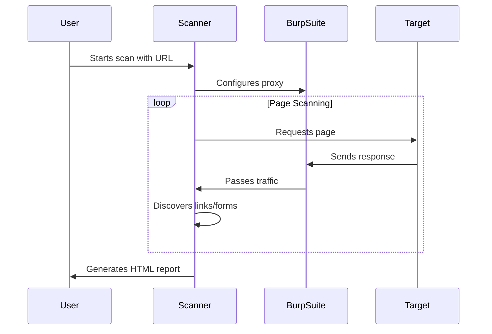

# BurpSuite Automated Scanner


The BurpSuite Automated Scanner is a powerful Python tool that automates web application security scanning by integrating with Burp Suite Community Edition. This tool navigates websites, interacts with forms, and proxies all traffic through Burp Suite, enabling security professionals to perform comprehensive vulnerability assessments efficiently.

## Key Features

- **Automated Web Crawling**: Recursively scans websites up to a configurable depth
- **Form Interaction**: Automatically discovers and submits forms with test data
- **Burp Suite Integration**: Routes all traffic through Burp's proxy for vulnerability detection
- **Professional Reporting**: Generates detailed HTML reports with scan metrics
- **Dynamic URL Handling**: Accepts target URLs at runtime via command line or interactive prompt
- **Rate Limiting**: Configurable delays between requests to avoid overwhelming servers
- **Modern Browser Simulation**: Uses headless Chrome with realistic user agent

## Use Cases

- Automated security testing in development pipelines
- Regular vulnerability scanning of web applications
- Educational purposes for learning web security
- Penetration testing reconnaissance
- Continuous security monitoring

## Prerequisites

1. **Burp Suite Community Edition**: [Download here](https://portswigger.net/burp/communitydownload)
2. **Python 3.8+**: [Download here](https://www.python.org/downloads/)
3. **Google Chrome**: [Download here](https://www.google.com/chrome/)
4. **ChromeDriver**: [Download here](https://chromedriver.chromium.org/) (must match your Chrome version)

## Installation

```bash
# Clone the repository
git clone https://github.com/your-username/burpsuite-automated-scanner.git
cd burpsuite-automated-scanner

# Create and activate virtual environment (recommended)
python -m venv venv
source venv/bin/activate  # Linux/Mac
venv\Scripts\activate    # Windows

# Install dependencies
pip install -r requirements.txt

# Download ChromeDriver and place in project directory
# Ensure it matches your Chrome version
```

## Configuration

Before running scans, configure Burp Suite:

1. Open Burp Suite Community Edition
2. Go to **Proxy** → **Options**
3. Ensure the proxy listener is active on `127.0.0.1:8080`
4. Turn **Intercept** to OFF
5. Go to **Dashboard** and ensure logging is enabled

## Usage

### Basic Scan

```bash
python run_scan.py https://example.com
```

### Interactive Mode

```bash
python run_scan.py
# Then enter the target URL when prompted
```

### Command Line Options

| Option | Description |
|--------|-------------|
| `python run_scan.py <url>` | Scan specific website |
| (no arguments) | Interactive URL prompt |
| `CTRL+C` | Abort scan at any time |

### Configuration Options

Edit `config.py` to customize scanning behavior:

```python
BURP_PROXY = "127.0.0.1:8080"  # Burp proxy address
SCAN_DEPTH = 2                 # How many levels deep to scan
OUTPUT_DIR = "reports"         # Report output directory
DRIVER_PATH = "chromedriver"   # ChromeDriver path
SCAN_DELAY = 1                 # Seconds between requests
```

## How It Works



1. **Initialization**: The tool configures a headless Chrome browser to route all traffic through Burp Suite
2. **Crawling**: Starts at the target URL and recursively discovers links up to the configured depth
3. **Form Handling**: Automatically submits forms with test data to maximize vulnerability exposure
4. **Traffic Analysis**: Burp Suite passively scans all traffic for vulnerabilities
5. **Reporting**: Generates a professional HTML report with scan metrics and page inventory

## Sample Report

The scanner generates comprehensive HTML reports in the `reports/` directory:


Report includes:
- Scan summary with key metrics
- Detailed list of scanned pages
- Depth analysis
- Next steps for security teams

## Limitations

1. **Burp Community Restrictions**: 
   - No direct API access (requires proxy workaround)
   - Limited to passive scanning only
   
2. **JavaScript Challenges**:
   - May not perfectly handle complex Single Page Applications
   - Some dynamic content might require manual interaction

3. **Authentication**:
   - Doesn't automatically handle complex login systems
   - Sites requiring CAPTCHAs or 2FA will fail

4. **Performance**:
   - Scanning large sites can be time-consuming
   - Resource-intensive due to browser automation

## Contributing

Contributions are welcome! Here's how to help:

1. Fork the repository
2. Create your feature branch (`git checkout -b feature/improvement`)
3. Commit your changes (`git commit -am 'Add some improvement'`)
4. Push to the branch (`git push origin feature/improvement`)
5. Open a pull request

### Areas for Improvement
- Add authenticated scanning capabilities
- Implement vulnerability detection in reports
- Support for other browsers (Firefox, Edge)
- Docker containerization
- Integration with OWASP ZAP

## License

This project is licensed under the MIT License - see the [LICENSE](LICENSE) file for details.

## Disclaimer

This tool is intended for legal security testing purposes only. Always obtain proper authorization before scanning any website. The developers assume no liability for misuse of this software.

---

**Happy Scanning!** 🛡️🔍
